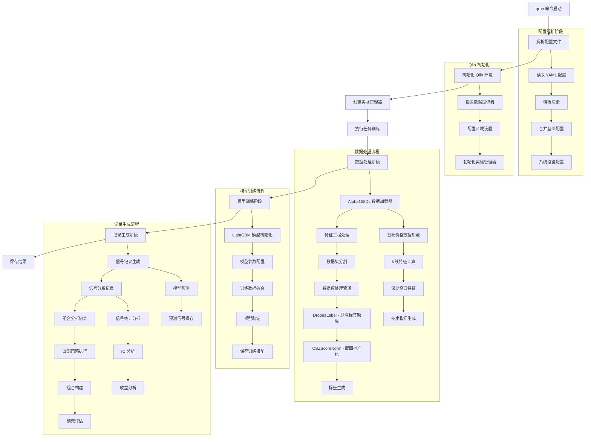

# Qrun LightGBM Alpha158 工作流程图

## 程序运行流程概览



## 详细执行步骤

### 1. 命令行入口 (qrun)
```bash
qrun benchmarks/LightGBM/workflow_config_lightgbm_Alpha158.yaml
```

### 2. 配置文件解析
- **文件**: `qlib/cli/run.py`
- **功能**: 
  - 读取 YAML 配置文件
  - Jinja2 模板渲染
  - 环境变量替换
  - 基础配置合并

### 3. Qlib 环境初始化
- **数据源**: `~/.qlib/qlib_data/cn_data`
- **市场**: CSI300 (中证300)
- **基准**: SH000300
- **实验管理**: MLflow 集成

### 4. 数据处理阶段

## 数据处理流程详细说明

### 数据处理流程位置和实现

数据处理流程主要在以下文件中实现：

#### 1. Alpha158 数据加载器 (`qlib/contrib/data/loader.py`)
- **类**: `Alpha158DL`
- **功能**: 生成158个技术指标特征
- **特征类型**:
  - **K线特征** (9个): KMID, KLEN, KMID2, KUP, KUP2, KLOW, KLOW2, KSFT, KSFT2
  - **价格特征** (4个): OPEN0, HIGH0, LOW0, VWAP0 (当日价格相对收盘价)
  - **滚动窗口特征** (145个): 基于5,10,20,30,60天窗口的技术指标

#### 2. 数据预处理器 (`qlib/data/dataset/processor.py`)
- **DropnaLabel**: 删除标签缺失的样本 (仅训练时使用)
- **CSZScoreNorm**: 截面标准化处理 (按日期分组标准化)

#### 3. 数据处理器 (`qlib/contrib/data/handler.py`)
- **Alpha158**: 继承自DataHandlerLP，整合数据加载和预处理

### Alpha158 特征详细构成

#### K线特征 (9个)
```python
# 基于开高低收价格的K线形态特征
"($close-$open)/$open",           # KMID - 实体大小
"($high-$low)/$open",             # KLEN - 影线长度  
"($close-$open)/($high-$low+1e-12)", # KMID2 - 实体占比
"($high-Greater($open, $close))/$open", # KUP - 上影线
"(Less($open, $close)-$low)/$open",     # KLOW - 下影线
"(2*$close-$high-$low)/$open",          # KSFT - 收盘位置
```

#### 滚动窗口技术指标 (145个)
基于 [5, 10, 20, 30, 60] 天窗口计算：

1. **ROC** (5个): 价格变化率
2. **MA** (5个): 简单移动平均
3. **STD** (5个): 价格标准差
4. **BETA** (5个): 价格趋势斜率
5. **RSQR** (5个): 线性回归R²值
6. **RESI** (5个): 线性回归残差
7. **MAX/MIN** (10个): 最高/最低价
8. **QTLU/QTLD** (10个): 80%/20%分位数
9. **RANK** (5个): 价格排名百分位
10. **RSV** (5个): 随机指标
11. **IMAX/IMIN** (10个): 最高/最低价距离天数
12. **IMXD** (5个): 高低点时间差
13. **CORR/CORD** (10个): 价格与成交量相关性
14. **CNTP/CNTN/CNTD** (15个): 上涨/下跌天数统计
15. **SUMP/SUMN/SUMD** (15个): 涨跌幅累计统计
16. **VMA/VSTD** (10个): 成交量移动平均和标准差
17. **WVMA** (5个): 成交量加权波动率
18. **VSUMP/VSUMN/VSUMD** (15个): 成交量变化统计

### 数据预处理管道

#### 学习阶段预处理 (learn_processors)
```python
[
    {"class": "DropnaLabel"},  # 删除标签缺失样本
    {"class": "CSZScoreNorm", "kwargs": {"fields_group": "label"}}  # 标签截面标准化
]
```

#### 推理阶段预处理 (infer_processors)
```python
[]  # Alpha158默认为空，不进行额外预处理
```

### 数据集分割
- **训练集**: 2008-01-01 到 2014-12-31 (7年)
- **验证集**: 2015-01-01 到 2016-12-31 (2年)
- **测试集**: 2017-01-01 到 2020-08-01 (3.5年)

### 标签生成
```python
# 未来2日收益率作为预测目标
"Ref($close, -2)/Ref($close, -1) - 1"
```

### 数据处理执行流程

1. **数据加载**: QlibDataLoader 从本地数据源加载原始OHLCV数据
2. **特征计算**: Alpha158DL.get_feature_config() 生成158个特征的计算表达式
3. **特征工程**: 基于原始数据计算所有技术指标特征
4. **数据分割**: 按时间范围分割训练/验证/测试集
5. **预处理**: 应用DropnaLabel和CSZScoreNorm处理器
6. **数据封装**: 封装为DatasetH对象供模型使用

#### 4.1 Alpha158 数据处理器
- **时间范围**: 2008-01-01 到 2020-08-01
- **训练期**: 2008-01-01 到 2014-12-31
- **验证期**: 2015-01-01 到 2016-12-31
- **测试期**: 2017-01-01 到 2020-08-01

#### 4.2 特征工程
- **特征集**: Alpha158 (158个技术指标特征)
- **标签**: 未来2日收益率 `Ref($close, -2)/Ref($close, -1) - 1`
- **预处理**: 
  - 缺失值删除 (DropnaLabel)
  - 截面标准化 (CSZScoreNorm)

### 5. 模型训练阶段

#### 5.1 LightGBM 模型配置
```yaml
model:
  class: LGBModel
  kwargs:
    loss: mse
    colsample_bytree: 0.8879
    learning_rate: 0.2
    subsample: 0.8789
    lambda_l1: 205.6999
    lambda_l2: 580.9768
    max_depth: 8
    num_leaves: 210
    num_threads: 20
```

#### 5.2 训练流程
1. 模型实例化
2. 数据集加载
3. 模型拟合 (`model.fit()`)
4. 模型参数保存

### 6. 记录生成阶段

#### 6.1 信号记录 (SignalRecord)
- 生成模型预测信号
- 保存预测结果

#### 6.2 信号分析记录 (SigAnaRecord)
- IC (信息系数) 分析
- 收益率统计
- 年化收益计算 (252个交易日)

#### 6.3 组合分析记录 (PortAnaRecord)
- **策略**: TopkDropoutStrategy
  - 选择前50只股票 (topk: 50)
  - 剔除5只股票 (n_drop: 5)
- **回测设置**:
  - 初始资金: 1亿元
  - 交易成本: 开仓0.05%, 平仓0.15%
  - 最小交易费用: 5元
  - 涨跌停限制: 9.5%

### 7. 结果保存
- **实验记录**: MLflow 跟踪
- **模型文件**: pickle 格式
- **配置信息**: 完整参数记录
- **性能指标**: 回测结果和分析报告

## 核心组件说明

### Alpha158 特征集
- **价格特征**: 开盘价、最高价、最低价、VWAP
- **技术指标**: 移动平均、动量指标、波动率指标等
- **总计**: 158个特征维度

### TopkDropoutStrategy 策略
- 基于模型预测信号选股
- 选择预测收益最高的前50只股票
- 随机剔除5只股票以增加多样性
- 等权重配置组合

### 时间分割策略
- **训练集**: 2008-2014 (7年历史数据)
- **验证集**: 2015-2016 (2年验证数据)  
- **测试集**: 2017-2020 (4年回测数据)

这个工作流程实现了一个完整的量化投资机器学习管道，从数据处理到模型训练，再到策略回测和性能评估。